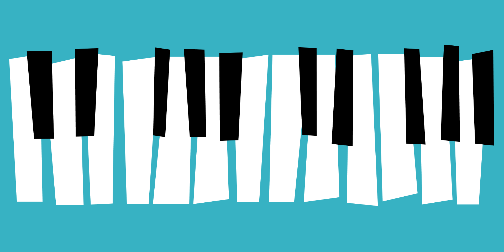

# Brief

In this project, we're creating a keyboard. I love this project because at first glance it seems easy, but there are some more complicated steps involved.

You can use as many (or as few) tools, libraries, and frameworks as you'd like. If you're trying to learn something new, this would be a great way to push yourself.

**Users should be able to:**

- See the keyboard centered on the page
- Whenever a user hovers over a specific key it will change colors
  - White keys will change to yellow `#ffd200`
  - Black keys will change to pink `#f40082`
- When a user clicks on a specific key, it will play an audio clip.
  - The audio clips are numbered, but I did not specifically number the keys. You can pick which key should be associated with each audio file.
  - If a user clicks on one key, then immediately clicks on a second key. The 2 files should both play. Meaning, clicking on one key will not stop an existing audio file from playing.

# Taking your Project to the Next Level

- Use a framework or library like [Tailwind CSS](https://tailwindcss.com/), [Styled Components](https://styled-components.com/), or [CSS Modules](https://github.com/css-modules/css-modules). Or, if you're feeling particularly adventurous, try writing everything in Vanilla CSS.
