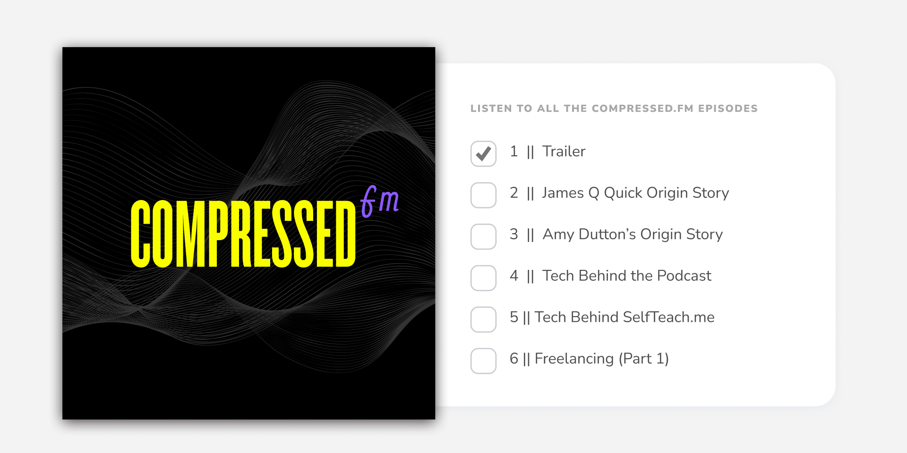

# Brief

In this project, we're going to check multiple checkboxes at one time.

You can use as many (or as few) tools, libraries, and frameworks as you'd like. If you're trying to learn something new, this would be a great way to push yourself.

**Users should be able to:**

- See the list of podcast episodes
- Checking off an episode will mark the episode as watched and will strike-through the title

# Getting Started

1. To get started, [download the files](./STARTER-FILES/). This includes all the project assets you need to get started: HTML, CSS, images, and fonts.
2. Take a look around. Look at the project's Figma file. This is a great way to see how the pieces and parts should look within the browser.
3. Open the project's `README.md` file. It has additional information on how the project is structured.
4. Customize your project / file architecture to your liking.
5. Happy coding!

# Content

1. Trailer
2. James Q Quick Origin Story
3. Amy Dutton Origin Story
4. Starting a New Development Project
5. How do you Start a New Design Project?
6. Freelancing (Part 1)

# Taking your Project to the Next Level

- Use a framework or library like [Tailwind CSS](https://tailwindcss.com/), [Styled Components](https://styled-components.com/), or [CSS Modules](https://github.com/css-modules/css-modules). Or, if you're feeling particularly adventurous, try writing everything in Vanilla CSS.
- Add an animation on load, have the podcast list slide out from under the podcast artwork
