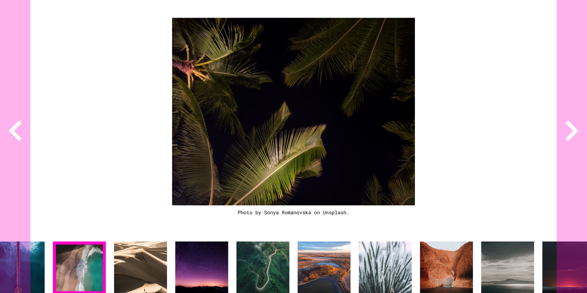

# Brief

In this project, we're going to create an image carousel.

You can use as many (or as few) tools, libraries, and frameworks as you'd like. If you're trying to learn something new, this would be a great way to push yourself.

# Users should be able to:

- The featured image is centered horizontally and vertically within the content area.
- The image's photo credits should appear as a caption, below the featured image. (content within the [STYLE-GUIDE.md](http://STYLE-GUIDE.md) inside the project starter files)
- Click on the next button to advance the featured image to the next image, listed in the thumbnails.
- Click on the previous button to change the featured image to the previous image in the carousel
- The thumbnails at the bottom should scroll horizontally and highlight the selected image.
- Toggle left and right through the image thumbnails
- Click an image to select it manually

# Getting Started

1. To get started, [download the files](./STARTER-FILES/). This includes all the project assets you need to get started: HTML, CSS, images, and fonts.
2. Take a look around. Look at the project's Figma file. This is a great way to see how the pieces and parts should look within the browser.
3. Open the project's `README.md` file. It has additional information on how the project is structured.
4. Customize your project / file architecture to your liking.
5. Happy coding!

# Taking your Project to the Next Level

- Use a framework or libraries like [Tailwind CSS](https://tailwindcss.com/), [Styled Components](https://styled-components.com/), or [CSS Modules](https://github.com/css-modules/css-modules). Or, if you're feeling particularly adventurous, try writing everything in Vanilla CSS.
