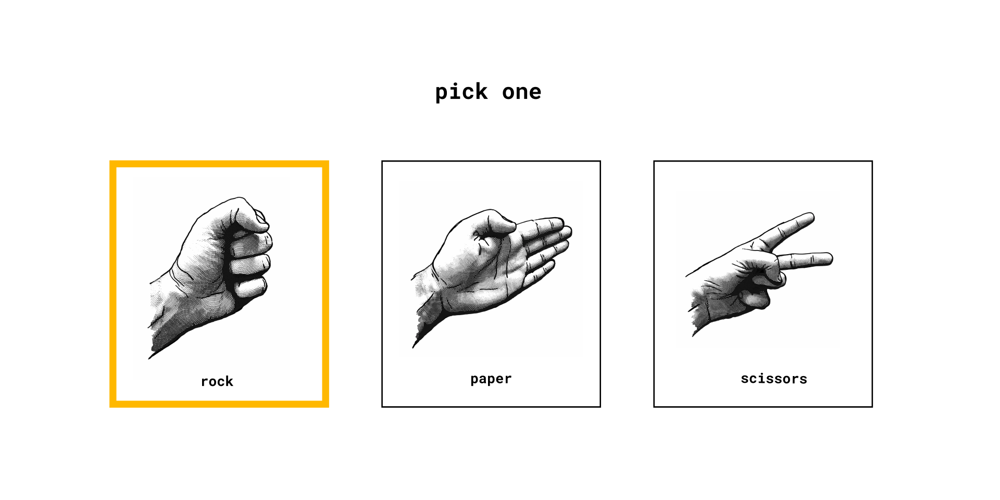

# Brief

In this project, we're creating a rock, paper, scissors game.

You can use as many (or as few) tools, libraries, and frameworks as you'd like. If you're trying to learn something new, this might be a great way to push yourself.

## Users should be able to:

- Select rock, paper, or scissors
- On a second page, they should see "you win" or the "computer wins." This page should also display the choices that the user and computer made, as well as, a button to play again.
- Play the game and see the results

# Getting Started

1. To get started, [download the files](./STARTER-FILES/). This includes all the project assets you need to get started: HTML, CSS, images, and fonts.
2. Take a look around. Look at the project's Figma file. This is a great way to see how the pieces and parts should look within the browser.
3. Open the project's `README.md` file. It has additional information on how the project is structured.
4. Customize your project / file architecture to your liking.
5. Happy coding!

# Taking your Project to the Next Level

- Use a framework or libraries like [Tailwind CSS](https://tailwindcss.com/), [Styled Components](https://styled-components.com/), or [CSS Modules](https://github.com/css-modules/css-modules). Or, if you're feeling particularly adventurous, try writing everything in Vanilla CSS.
- Animate the elements loading onto the page
- Animate the page transition, showing who won.
